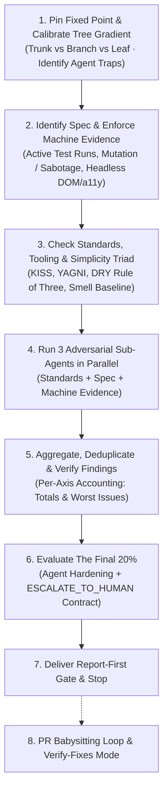

Review the diff between `HEAD` and a fixed point along a **risk-calibrated gradient** across three complementary axes:

- **Standards** — does the code conform to repository standards, clean code, and the simplicity triad (KISS/YAGNI/DRY)?
- **Spec** — does the code faithfully implement the originating issue / PRD / spec without omissions or scope creep?
- **Machine Evidence & Blast Radius** — does the change supply verifiable, machine-executable proof (active test passes, mutation / Fast Sabotage results, typechecks, headless DOM/a11y trees, AST feature-flag checks) commensurate with its blast radius on the code tree?

All three axes run as **parallel adversarial sub-agents** with clean contexts, eliminating confirmation bias and correlated hallucinations from the original generation prompt.



---

## Process

### 1. Pin the fixed point and calibrate the risk gradient (The Tree Concept)

1. **Resolve the fixed point and comparison refs**:
   - Capture the fixed point (`main`, commit SHA, branch name, tag, etc.). If omitted, prompt the user.
   - Run `git rev-parse <fixed-point>` and confirm the diff is non-empty.
   - Capture comparison commands:
     ```sh
     git diff <fixed-point>...HEAD
     git log <fixed-point>..HEAD --oneline
     ```
   - Note the base ref as the initial `<review-point>`. When later running subsequent verify-fixes passes, the comparison ref is `<review-point>..HEAD` (or uncommitted changes), where `review-point` is the commit SHA evaluated during the prior review pass.

2. **Model the codebase as a tree & calibrate agent review posture**:
   Human reviewers skim Leaf code to save time and manually inspect Trunk code. Agent reviewers must take the opposite posture to guard against LLM failure modes:
   - **Trunk Code (High Blast Radius — The Agent Trap)**: Core infrastructure, networking, authentication/authorization engines, database schemas and migrations, global state managers, base framework lifecycles, and shared foundational utility packages.
     - *Agent Failure Mode*: An LLM reviewer is easily tricked by Trunk code that looks syntactically clean and idiomatic, missing subtle concurrency races, distributed deadlocks, schema lock contention, or caching edge cases.
     - *Agent Review Posture*: Do not trust syntax alone. Demand independent verification ([IV-TDD](../test-first-delivery-generalized/SKILL.md)), require mutation falsification (`mutation_score >= 0.90` or documented pass of the Fast Sabotage Litmus Test), audit strict backwards compatibility, and **route to the Human Escalation Gate** for architectural sign-off.
   - **Branch Code (Moderate Blast Radius)**: Domain business logic, bounded feature services, API controllers, worker processors, and shared component modules.
     - *Agent Review Posture*: Dual-axis Standards + Spec review with active execution of automated unit/integration test suites.
   - **Leaf Code (Low / Zero Blast Radius — The Agent Strength)**: Isolated UI views, leaf endpoints, standalone scripts, or feature-gated components that can be safely disabled without collateral impact.
     - *Agent Review Posture*: High-velocity, exhaustive mechanical audit. Verify 100% of types, prop contracts, linter constraints, and headless DOM/a11y trees. Perform an **AST feature-flag check** to prove the feature is wrapped in a dynamic toggle with a working fallback.
   *(See [references/tree-concept-gradient.md](references/tree-concept-gradient.md) for detailed classification).*

3. **Calibrate operational exposure**:
   - Ask: **has any of this diff already run outside local development?** (deployed, migrated, sent real traffic/email/data). Pre-production code can be directly restructured; shipped code requires non-destructive, forward-compatible migrations.

4. **Unreleased code & legacy retention policy**:
   - When deciding whether to keep legacy methods, deprecated routes, fallback mechanisms, or dual-writes on development branches, check if `main` has already merged the legacy code. If `main` has never merged or released it, delete the legacy code and keep only the canonical implementation (YAGNI/KISS). Reviewers must not flag the removal of unreleased legacy paths as a breaking change.

---

### 2. Identify the spec source and demand machine-verifiable evidence

1. **Locate the originating spec** in order:
   - Issue tracker references in commits (`#123`, `Closes #45`, GitLab `!67`) — fetch via `docs/agents/issue-tracker.md` (run `/setup-matt-pocock-skills` if `docs/agents/issue-tracker.md` is missing).
   - A path passed by the user.
   - PRD or spec file under `docs/`, `specs/`, or `.scratch/` matching the branch or feature.
   - If missing, ask the user for the spec.
   - If no spec exists, run in **degraded mode**: treat commit messages as a weak spec and verify self-consistency (flagging commit claims not honored or unmentioned diff behavior). Mark as `Spec (degraded — self-consistency vs commit messages)`.

2. **Machine-Verifiable Evidence Gate**:
   An agent reviewer requires active, reproducible proof rather than passive text claims. Summary scorecards and detailed protocol live in [references/evidence-and-launch-checklist.md](references/evidence-and-launch-checklist.md):
   - **Active Execution**: The reviewer executes the test suite, confirming exit code `0` and clean stderr without unhandled rejections or memory warnings.
   - **Logic Falsification**: Require mutation testing (`mutation_score >= 0.90`) **or** a documented pass of the Fast Sabotage Litmus Test.
   - **Static & Structural Validation**: Confirm clean typecheck passes (`tsc --noEmit`), headless DOM/a11y tree structures for UI components, and AST proof of feature-flag wrapping.

---

### 3. Identify standards sources and the simplicity triad

1. **Survey standards**:
   - Check `CONTRIBUTING.md`, `CODING_STANDARDS.md`, agent instructions (`AGENTS.md`, `CLAUDE.md`, `.agents/**`), architecture docs, and README files.
   - **Check what tooling enforces first**: Lint configs, formatters, type-checkers, CI gates. Anything tooling already enforces is **out of scope** for agent review; focus strictly on logic, design, security, and maintainability.

2. **The methodology test**:
   Every finding must demonstrate harm to one of three outcomes: **changeable**, **readable**, or **testable**. State the concrete maintenance cost, not just stylistic preferences.

3. **KISS, YAGNI, and DRY Simplicity Triad**:
   - **KISS (Keep It Simple, Stupid)**: Favor the most straightforward, readable solution for every line. Extreme readability over cleverness.
   - **YAGNI (You Aren't Gonna Need It)**: Code only for current, proven requirements. Reject speculative helpers, single-use classes, extra parameters, or premature generalizations.
   - **DRY vs. YAGNI (The Tension)**: Enforce the **Rule of Three** — abstract only on the third occurrence. Duplication predates the diff; grep codebase-wide to confirm the true count before suggesting extraction.
   - **DRY vs. KISS (The Balance)**: A little duplication is far better than a bad, confusing abstraction (**KISS wins**).

4. **Code Smell Baseline**:
   Apply the smell baseline (Naming & Structure, Duplication & Coupling, Overengineering, Bigness, Error Flow, Tests as Review Surface) as defined in [references/code-smell-baseline.md](references/code-smell-baseline.md).

---

### 4. Run the reviews (Adversarial Agentic Topology)

1. **Topology & Adversarial Isolation**:
   - Launch **three parallel sub-agents** with clean, isolated contexts:
     1. **Standards Sub-agent**
     2. **Spec Sub-agent**
     3. **Machine Evidence Sub-agent**
   - **Adversarial Mandate**: Sub-agents must run in fresh contexts without access to the author agent's prompt history. This breaks **confirmation bias** and prevents **correlated LLM hallucinations**.
   - **Hunt Correlated LLM Blind Spots**: Challenge plausible-looking syntax, check boundary edge cases, verify error propagation, and ensure tests assert independent contract values rather than tautologies.

2. **Partitioning Large Diffs**:
   - For large diffs (>2,000 lines or >40 files), partition the **Standards** axis by architectural area (e.g., `api/`, `web/`, `infra/`, `tests/`) into additional parallel sub-agents. Give every partition identical methodology text; partition coverage, not judgment.
   - The Spec agent and Evidence agent always evaluate the whole diff.

3. **Interface & Boundary Checks**:
   - When diffs cross boundaries (API ↔ client, schema ↔ model, template ↔ CSS, docs ↔ code), assign an explicit cross-surface pass to verify contract alignment.

4. **Investigative Authority**:
   - Review sub-agents may run **read-only** commands (`git grep`, running test runners, reading quoted files) to turn hypotheses into verified evidence. They must not modify working tree files.

5. **Sub-agent Briefs (Methodology Inlining Rule)**:
   Because sub-agents run in isolated contexts, **paste the methodology, the simplicity triad, and the code smell baseline in full into the brief** — the sub-agent has no other access to it:
   - **Standards Sub-agent Brief**: Include diff command, commit list, operational exposure, tree classification, standards files, exclusions, **the full simplicity triad**, and **the code smell baseline from [references/code-smell-baseline.md](references/code-smell-baseline.md)** pasted in full. Brief: "Report findings in this exact schema: `location (file:line) · category (documented-standard violation | suspected bug | smell) · severity (high | medium | low) · confidence (verified | reported) · evidence (quote code) · cost (stated maintenance impact)`. Skip tooling-enforced checks. Order by severity; cap detailed findings at ~10."
   - **Spec Sub-agent Brief**: Include diff command, commit list, and spec source (or commit list in degraded mode). Brief: "Report: (a) missing/partial requirements, (b) unrequested behavior (scope creep), (c) incorrect implementations. Quote the spec line for each finding."
   - **Machine Evidence Sub-agent Brief**: Include test commands, container runtime instructions, and tree tier. Brief: "Actively execute test suites and linters. Report: (a) test suite pass/fail status and exit codes, (b) mutation score or Fast Sabotage results, (c) typecheck results, (d) headless DOM/a11y tree verification for UI components, (e) AST feature-flag gating proof."

---

### 5. Aggregate and verify

1. **Verify**: Open every high-severity finding and a sample of the rest at its quoted location. Mark findings `verified` or `unverified`; drop invalid findings. Require proof of non-use (including dynamic reference patterns) before publishing deletion-class findings.
2. **Dedup with attribution**: Merge identical issues reported by multiple agents, crediting both.
3. **Keep axes separate**: Present findings under `## Standards`, `## Spec`, and `## Machine Evidence & Blast Radius`. Do not merge or rerank across axes.
4. **Per-Axis Accounting**: Conclude the report with a one-line summary per axis: total verified/unverified findings and the worst issue within each axis. Do not pick a single winner across axes.
5. **State static review limits**: Explicitly declare anything not verifiable statically or via headless test tools.

---

### 6. The Final 20%: Automated Hardening vs. Human Escalation Gate

The review evaluates the Final 20% along two explicit paths:

1. **Agent-Owned Hardening**:
   - **Hygiene & Dead Code**: Confirm removal of temporary debug logs, exploratory probes, and unreleased legacy shims.
   - **Security Audit**: Confirm input sanitization, parameter escaping, authentication guards, and absence of exposed secrets.
   - **Performance Patterns**: Flag queries in loops (N+1), un-indexed query filters, or unbounded memory allocations.
   - **Feature-Flag AST Verification**: Confirm that new leaf code is conditionally guarded by a dynamic toggle and that the fallback path executes cleanly.

2. **Human Escalation Gate (`ESCALATE_TO_HUMAN`)**:
   When Trunk code is modified, public API ergonomics are altered, or launch safety requires business risk appraisal, output an explicit machine-actionable escalation block (canonical schema defined in [references/evidence-and-launch-checklist.md](references/evidence-and-launch-checklist.md)):

```yaml
escalate_to_human:
  status: REQUIRED  # REQUIRED | NOT_APPLICABLE
  tier: TRUNK       # TRUNK | BRANCH | LEAF
  blast_radius: "Core auth token issuance and session persistence"
  invariants_verified:
    - "Backwards compatibility verified across existing schema"
    - "Authoritative test suite passed; Fast Sabotage killed 3/3 mutants"
  human_signoff_items:
    - item: "Architectural concurrence on token expiry lifecycle"
    - item: "Visual & UX verification of login redirect flow"
    - item: "Canary rollout staged at 1% traffic"
```

Autonomous orchestrators (`Task Orchestrator`) must not auto-merge or auto-commit tasks bearing an active `escalate_to_human: REQUIRED` block without interactive user sign-off.

---

### 7. Report-first gate (mandatory)

Deliver the aggregated report and **stop**.

Never implement code fixes in the same turn unless the user explicitly requested fixes in the initial prompt. Findings are decision artifacts for the owner to accept, reject, or re-scope. Auto-fixing collapses review into an unreviewable mutation.

---

## PR Babysitting & Verify-Fixes Mode

When iterating on review feedback or running automated feedback resolution, follow the **PR Babysitting Protocol**:

1. **Triage Findings**: Address High-severity issues and missing machine evidence first.
2. **Apply Minimal Surgical Fixes**: Fix only the flagged defect adhering strictly to KISS/YAGNI. Do not introduce wide secondary refactors that expand the diff.
3. **Re-Validate & Refresh Evidence**: Run automated tests in the appropriate container/runtime, verify exit code `0`, and update headless DOM/runtime traces.
4. **Run `verify-fixes` Review**:
   - Re-review the exact fix diff between the prior review point and current HEAD:
     ```sh
     git diff <review-point>..HEAD
     ```
   - Apply the fix lens: *Did the fix introduce what it was fixing? Did it loosen validation too far? Did it break adjacent callers?*
   - Update `<review-point>` to current HEAD.
5. **Iterate until Clean**: Continue until all blocking findings and evidence gaps are resolved.

---

## References & Checklists

- [references/code-smell-baseline.md](references/code-smell-baseline.md) — Comprehensive code smell catalog with mechanical detection cues, grep patterns, cost symptoms, and test review standards.
- [references/tree-concept-gradient.md](references/tree-concept-gradient.md) — Code classification (Trunk vs Leaf), blast radius diagnostic questions, and scrutiny gradient matrix from an agent reviewer perspective.
- [references/evidence-and-launch-checklist.md](references/evidence-and-launch-checklist.md) — Agent-verifiable evidence protocols, automated hardening checklist, ESCALATE_TO_HUMAN machine contract, and PR babysitting workflow.

## Related Skills

- [`clean-code-and-oop`](../clean-code-and-oop/SKILL.md) — Authoritative standards for Clean Code, OOP architecture, and safe refactoring.
- [`backend-bug-review-generalized`](../backend-bug-review-generalized/SKILL.md) — Backend defect and regression auditing.
- [`frontend-bug-review-generalized`](../frontend-bug-review-generalized/SKILL.md) — Frontend rendering, state, and interaction auditing.
- [`security-defense-and-mitigation`](../security-defense-and-mitigation/SKILL.md) — Security vector, injection, and authorization auditing.
- [`test-first-delivery-generalized`](../test-first-delivery-generalized/SKILL.md) — Independent verification and authoritative test freezing.
- [`document-touched-code`](../document-touched-code/SKILL.md) — JSDoc contracts and interface documentation.
