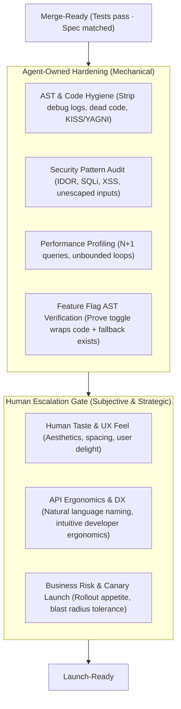
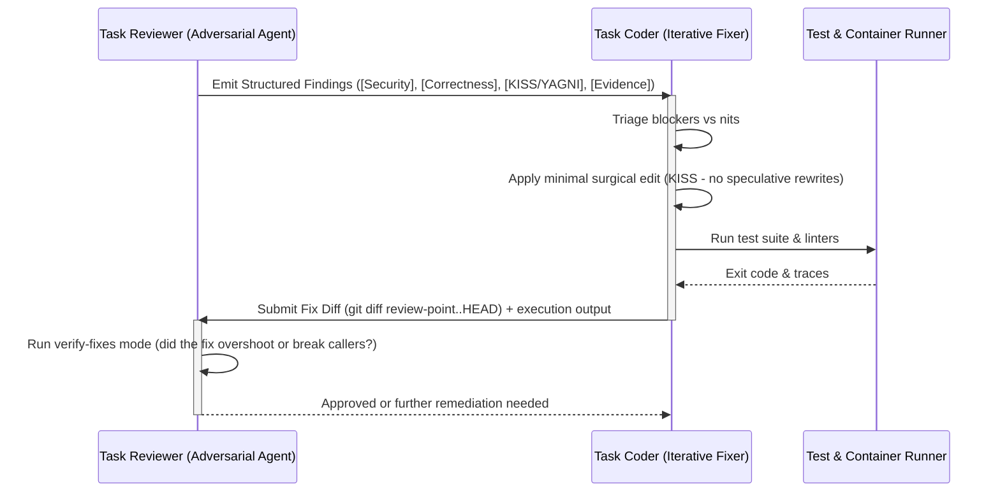

# Evidence-Based Verification, The Final 20%, and PR Babysitting for Agent Reviewers

Unlike human reviewers who passively inspect diffs in a browser, an **AI Agent Reviewer** possesses tool execution authority. The agent must not accept passive claims or evaluate human-sensory artifacts; it must actively **falsify code**, verify **machine-readable contracts**, perform **automated hardening**, and route subjective concerns through a **human escalation gate**.

---

## 1. Agent-Verifiable Evidence Protocol

An agent reviewer does not judge visual aesthetics or trust author claims. It requires and actively verifies **machine-readable proof**:

### A. Active Logic Verification (Test Execution & Falsification)
- **Active Execution**: The agent runs the test runner directly using terminal/container tools, inspecting stdout, stderr, and exit codes. Never accept a pasted log without running or confirming execution.
- **Falsification & Independence**: Verify that tests do not simply parrot the implementation (tautological tests). On Trunk or logic-heavy code, verify that [Independent Verification (IV-TDD)](../../test-first-delivery-generalized/SKILL.md) was followed.
- **Mutation Falsification & Fast Sabotage**: Require mutation testing on core logic (`killed / total >= 0.90`) **or** a documented pass of the **Fast Sabotage Litmus Test** (deliberately perturbing 2–3 production invariants to prove tests turn RED). Surviving mutants or tests that stay green during sabotage indicate toothless or tautological tests.
- **Mutation & Sabotage Execution Protocol**: Because mutation tooling (e.g. Stryker, mutmut) and Fast Sabotage modify source files, the authoring or tester agent executes the mutation run / sabotage perturbations during implementation or test-prep and records the report (mutation score, surviving mutants, or sabotage probe diffs) in the task handoff contract or PR description. The reviewer verifies the recorded report and, if equipped with an isolated container or CI scratch environment, may independently reproduce the run without mutating working tree files.

### B. Machine-Readable Runtime Proof
- **Exit Code Integrity**: Clean exit code `0` with zero unhandled promise rejections, memory leak warnings, or deprecation alerts in test output.
- **Schema & Type Validation**: Clean typecheck passes (`tsc --noEmit`, `mypy`, or language equivalent) and schema validation outputs.
- **Query & Resource Profiling**: For database or backend changes, inspect query execution plans (explain analyze) to confirm index usage and absence of N+1 query loops.

### C. Headless UI & Structural Verification
- **DOM & Accessibility (a11y) Trees**: Inspect rendered DOM trees and accessibility node trees (ARIA roles, keyboard navigable focus states, semantic landmarks) rather than attempting to evaluate visual beauty.
- **Component State Probes**: Automated test assertions covering all visual component states: initial, loading, empty, error, and populated.
- **Human Visual Assets**: Confirm that screenshots or visual diffs have been saved to the PR/handoff artifact *for human inspection*, but base the agent's pass/fail judgment strictly on structural and contract correctness.

### Evidence Scorecard (Agent Reviewer)
| Risk Tier | Mandatory Machine Evidence | Missing Action |
| :--- | :--- | :--- |
| **Trunk** | Authoritative tests + Mutation score >= 0.90 (or Fast Sabotage Litmus pass) + Typecheck clean | **Reject Task**: Block until falsification tests exist |
| **Branch** | Unit/integration test run (exit code 0) + Typecheck clean | **Reject Task**: Block until test suite passes |
| **Leaf** | Component test + Headless DOM/a11y check + Feature-flag AST verification | **Reject Task**: Block until feature gate & tests pass |

*Scope Note*: Scorecard actions govern task-based delivery flows (`Task Orchestrator` / `PLAN.md`). In ad-hoc reviews (e.g. plain PRs or `review since X` where no task runner exists), missing evidence is reported as a blocking **High-Severity finding** in the `## Machine Evidence & Blast Radius` section instead of triggering a task rejection.

---

## 2. The Final 20%: Automated Hardening vs. Human Escalation Gate

The "Final 20%" represents the gap between code that merely satisfies a ticket and code that is safe for production. The agent reviewer splits this stage into **Automated Hardening** (which the agent executes) and the **Human Escalation Gate** (which the agent flags for human taste and business risk).



### A. Agent-Owned Hardening Checklist
1. **Hygiene & Simplicity (KISS/YAGNI)**:
   - Verify that all debug logs, exploratory probes, and commented-out code have been removed.
   - Enforce the **Rule of Three**: search the codebase for proposed abstractions; if fewer than 3 call sites exist, reject the abstraction (KISS wins).
   - Verify removal of unreleased legacy paths per repository retention policy.
2. **Security & Threat Vector Audit**:
   - Inspect input boundaries for sanitization and escaping (SQLi, XSS, command injection).
   - Verify authorization checks on every endpoint/resolver (preventing IDOR/BOLA).
   - Ensure no secrets or API keys are committed or logged.
3. **Performance Static Checks**:
   - Flag database queries inside loops (N+1 anti-pattern).
   - Verify that queried fields have supporting database indexes.
4. **Feature-Flag AST Verification**:
   - Check the code AST: Is the new leaf feature wrapped in a dynamic feature flag or kill-switch?
   - Verify that the fallback path executes cleanly if the flag evaluates to false.

### B. Human Escalation Gate Checklist
The agent cannot experience human taste or weigh organizational business risk. The agent reviewer must compile and escalate these specific items to the human in the review report:
- **Trunk Blast Radius**: Summarize all core modules affected and explicitly request human architectural sign-off.
- **Human Taste & UX**: Point the human reviewer to generated visual artifacts (screenshots, UI components) to evaluate spacing, visual hierarchy, and interaction feel.
- **API Ergonomics**: Flag new public API method signatures for human developer-experience review.
- **Rollout Strategy**: Note whether the feature requires canary rollout or database migration sequencing.

#### ESCALATE_TO_HUMAN Machine Contract
When Trunk code is modified or launch safety is not fully automated, the review report must emit an explicit machine-actionable escalation block:

```yaml
escalate_to_human:
  status: REQUIRED  # REQUIRED | NOT_APPLICABLE
  tier: TRUNK       # TRUNK | BRANCH | LEAF
  blast_radius: "Core auth token issuance and session persistence"
  invariants_verified:
    - "Backwards compatibility verified across existing schema"
    - "Authoritative test suite passed; Fast Sabotage killed 3/3 mutants"
  human_signoff_items:
    - item: "Architectural concurrence on token expiry lifecycle"
    - item: "Visual & UX verification of login redirect flow"
    - item: "Canary rollout staged at 1% traffic"
```

Autonomous orchestrators (`Task Orchestrator`) must not auto-merge or auto-commit tasks bearing an active `escalate_to_human: REQUIRED` block without interactive user sign-off.

---

## 3. PR Babysitting Protocol (Agent Autonomous Loop)

In autonomous engineering teams, the PR babysitting loop resolves review findings through minimal, iterative agent cycles without human toil:



### Execution Rules for the Babysitting Loop:
1. **Machine-Actionable Findings**: Reviewer agents must report exact `file:line` locations, category tags, and concrete remediation instructions. Avoid vague aesthetic commentary.
2. **Surgical Diffs Only**: The fixing agent must modify *only* the flagged lines. Never introduce wider refactors during a fix pass, as this broadens the review surface and introduces new defects.
3. **Verify-Fixes Analysis**: The reviewer inspects `git diff <review-point>..HEAD` with one primary question: *Did this fix introduce a secondary defect or loosen validation?*
4. **Exit Criteria**: The loop terminates with approval once all blocker categories pass and all machine evidence is verified.
