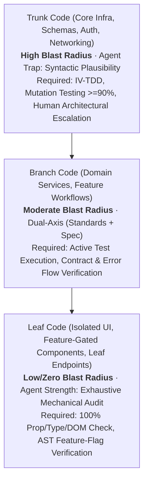

# The Tree Concept & Risk Gradient Matrix for Agent Reviewers

Review intensity must follow a **gradient based on architectural risk, blast radius, and testability**. Crucially, an **AI agent reviewer** operates under different strengths and failure modes than a human reviewer:

- **Humans** suffer from fatigue and skim Leaf code to save time, reserving manual scrutiny for Trunk code.
- **Agents** excel at exhaustive mechanical checking on Leaf code (types, props, linters, DOM trees), but are vulnerable to **syntactic plausibility bias** and **shared LLM hallucinations** on Trunk code.

---

## 1. Code Classification from an Agent's Perspective

### Trunk Code (High Blast Radius — The Agent Trap)
- **What it is**: Core infrastructure, networking clients, database access/ORM drivers, schemas and migrations, authentication/authorization engines, global state, message queues, and foundational utilities.
- **Agent Failure Mode**: An LLM agent reviewer is easily deceived by Trunk code that looks syntactically clean and idiomatic, missing subtle concurrency races, distributed deadlocks, schema lock contention, or caching edge cases.
- **Agent Review Imperatives**:
  - **Do not trust syntax alone**: Never approve Trunk code on visual code inspection.
  - **Demand Independent Verification (IV-TDD)**: Verify that authoritative tests were authored independently without seeing the implementation.
  - **Execute Mutation Falsification**: Require a mutation kill score of `>= 0.90` (or a documented pass of the Fast Sabotage Litmus Test) on logic-heavy Trunk modules.
  - **Audit Invariant Defense**: Verify backwards compatibility, idempotent operations, and non-destructive migrations.
  - **Mandatory Human Escalation**: Explicitly flag Trunk changes in the final review report for senior human architectural sign-off.

### Branch Code (Moderate Blast Radius)
- **What it is**: Domain business logic, bounded feature services, API controllers, worker processors, and shared component modules.
- **Agent Review Imperatives**:
  - Dual-axis Standards + Spec review.
  - Active execution of automated test suites; verify exit code `0` and inspect failure traces.
  - Verify clean API boundaries: ensure domain logic does not leak internal data structures into Trunk or sibling Branches.
  - Check error propagation: verify exceptions are not swallowed or used for normal control flow.

### Leaf Code (Low / Zero Blast Radius — The Agent's Strength)
- **What it is**: Isolated UI views, leaf endpoints, standalone scripts, or feature-gated components that can be safely disabled without collateral impact.
- **Agent Strength**: An agent can exhaustively check every prop, type definition, linter constraint, and DOM attribute without fatigue.
- **Agent Review Imperatives**:
  - High velocity, exhaustive mechanical verification.
  - **AST Feature-Flag Verification**: Inspect code to prove that the new functionality is completely enclosed within a dynamic feature toggle or configuration switch.
  - **Headless Verification**: Inspect rendered DOM trees, semantic HTML, and accessibility (a11y) tree structures.
  - Confirm that disabling the flag cleanly renders the fallback path without exceptions.

---

## 2. Blast Radius Diagnostic Questions for the Agent

When calibrating a diff, run these targeted code queries:

1. **Dependency Analysis**: Grep the codebase for symbols touched in the diff. How many external files import or call these symbols?
   - `> 10 callers / cross-package`: **Trunk**
   - `2 - 10 domain callers`: **Branch**
   - `0 - 1 caller / self-contained`: **Leaf**
2. **Persistence & Schemas**: Does the diff touch database migrations, ORM schemas, serialization formats, or shared cache keys? (Stateful changes are **Trunk** by default).
3. **AST Gating Check**: Is the entry point wrapped in an `if (featureFlags.isEnabled(...))` or equivalent dynamic check?
4. **Security & Financial Seams**: Does the diff touch authorization middleware, token issuance, payment processing, or PII handling?

---

## 3. Scrutiny Gradient Matrix (Agent Reviewer)

| Dimension | Leaf Code | Branch Code | Trunk Code |
| :--- | :--- | :--- | :--- |
| **Blast Radius** | Localized / Zero collateral | Bounded to domain | System-wide / Core infra |
| **Agent Posture** | Exhaustive mechanical audit | Dual-axis Standards + Spec | Adversarial falsification & invariant audit |
| **Verification Method** | Typecheck + lint + DOM/a11y tree check | Active unit & integration test run | IV-TDD + Mutation score >= 0.90 (or Fast Sabotage Litmus pass) |
| **Feature Isolation** | AST check: Flag wraps entry point & fallback exists | Graceful degradation on dependency failure | Forward-compatible migration & zero-downtime safety |
| **Correlated Risk** | Low (isolated scope) | Medium | High (LLM plausible hallucination trap) |
| **Approval Authority** | Agent can fully approve | Agent approves + human glance | Agent audits + **Mandatory Human Escalation** |
